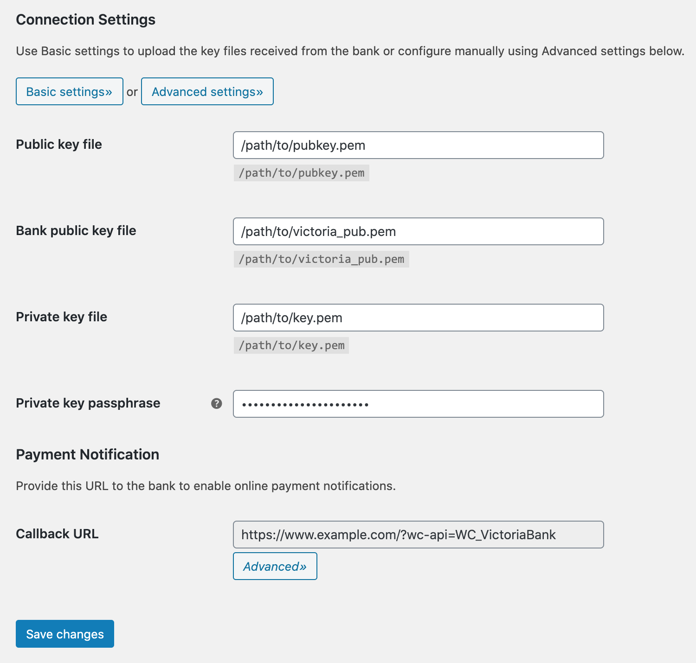

# WooCommerce Victoriabank Payment Gateway

_Accept Visa and Mastercard directly on your store with the Victoriabank payment gateway for WooCommerce._

WordPress plugin: https://wordpress.org/plugins/wc-victoriabank/

## Features

* Charge and Authorization card transaction types
* Reverse transactions – partial or complete refunds
* Admin order actions – complete authorized transaction
* Order confirmation email with card transaction details
* Supports WooCommerce [block-based checkout experience](https://woo.com/checkout-blocks/)
* Free to use – [Open-source GPL-3.0 license on GitHub](https://github.com/alexminza/wc-victoriabank)

## Getting Started

* [Installation Instructions](https://wordpress.org/plugins/wc-victoriabank/installation/)
* [Frequently Asked Questions](https://wordpress.org/plugins/wc-victoriabank/faq/)

## Screenshots

1\. Plugin settings

2\. Merchant data

3\. Connection settings

4\. Advanced connection settings

5\. Refunds

6\. Order actions

